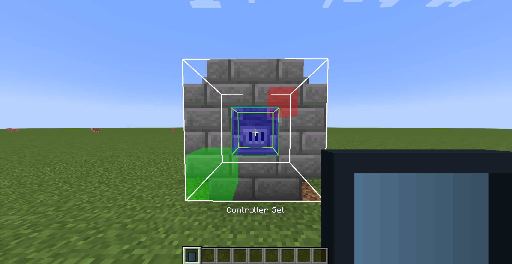
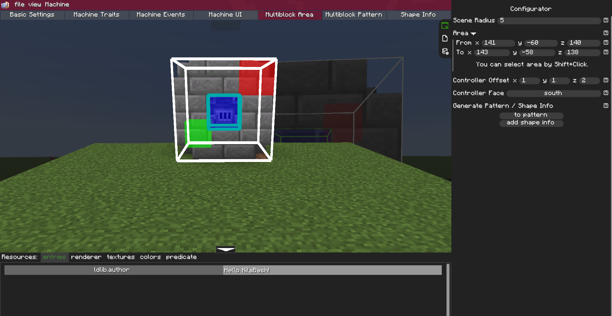

# Multiblocked2 Additions

Multiblocked2 Additions is a quality of life addon for Multiblocked2. The Multiblocked2 editor is great, but it was missing a bunch of small quality of life features I wanted — so I added them.

## Screenshots

## Features

### Editor Tablet
The core item of the mod, which add the ability to opens the Multiblocked2 editor.
- New tablet item with two modes: editor and multiblock selection
- Multiblock selection mode — select blocks (or air) in the world as the machine pattern instead of using the hard to use (IMO) preview in the mutliblock area tab specially if you are dealing with giant multiblock (**HOW TO USE: simply hold the tablet and switch to the selection mode by pressing the keybind "default to M" then right click the first corner your multiblock then right click the second corner then sneak + right click to set the controller and then open the editor to to pattern and add shape info**).
- Ghost preview of the selection, only visible while holding the tablet to make it easier to see what block you are gonna select
- Dedicated keybinds for opening the editor and switching tablet modes

### Machine Editor Improvements
- Machine hot reload — changes to machines you already built apply automatically, no restart needed; creating a brand-new machine still needs a restart
- Project autosave on creation, on an interval (default to save every 5 min), on switching projects and on close
- Editor remembers the last opened tab
- Side panel remembers open/close state and skips the slide animation on tab enter
- Unique machine ids generated on project creation (no more accidentally crashing the game cuz you forgot to change the machine ID to unique one)
- Editor window view scaled independently from the game GUI scale (change the scale inside the editor doesn't change the scale your game GUI which was huge pain since I don't want to use microscope to be able to look at my inventory)
- Configurator fields lose focus when clicking outside and accept digits only (no more accidentally typing inside the configurator while your doing something outside of it)

## Dependencies

- Forge: LDLib 1.0.50+ and Multiblocked2 1.0.38.a+

## SOME NOTES

My mods and texture packs are officially published only on Modrinth. Since this mod is licensed under the MIT License, you may also see reuploads elsewhere, so please download only from sources you trust and be careful with random files.

An AI coding agent was used during development. Just putting it out there for transparency. If that bothers you, that is completely fine use it, avoid it, ignore it or simply do what you want with it. It is up to you.

If you look at the source code you will see that is built using a multiloader template even though only the Forge version is released. The Fabric build is currently disabled because Multiblocked2 itself is Forge-only, but if I ever port Multiblocked2 to Fabric first, a Fabric version of this mod will probably follow.

## License

Spoiler

MIT License

Copyright (c) 2026 ABO47

Permission is hereby granted, free of charge, to any person obtaining a copy
of this software and associated documentation files (the "Software"), to deal
in the Software without restriction, including without limitation the rights
to use, copy, modify, merge, publish, distribute, sublicense, and/or sell
copies of the Software, and to permit persons to whom the Software is
furnished to do so, subject to the following conditions:

The above copyright notice and this permission notice shall be included in all
copies or substantial portions of the Software.

THE SOFTWARE IS PROVIDED "AS IS", WITHOUT WARRANTY OF ANY KIND, EXPRESS OR
IMPLIED, INCLUDING BUT NOT LIMITED TO THE WARRANTIES OF MERCHANTABILITY,
FITNESS FOR A PARTICULAR PURPOSE AND NONINFRINGEMENT. IN NO EVENT SHALL THE
AUTHORS OR COPYRIGHT HOLDERS BE LIABLE FOR ANY CLAIM, DAMAGES OR OTHER
LIABILITY, WHETHER IN AN ACTION OF CONTRACT, TORT OR OTHERWISE, ARISING FROM,
OUT OF OR IN CONNECTION WITH THE SOFTWARE OR THE USE OR OTHER DEALINGS IN THE
SOFTWARE.

